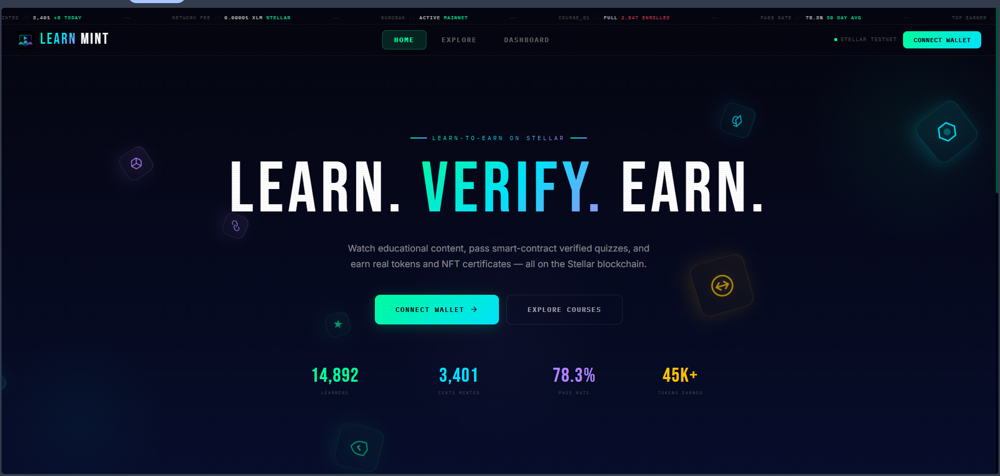
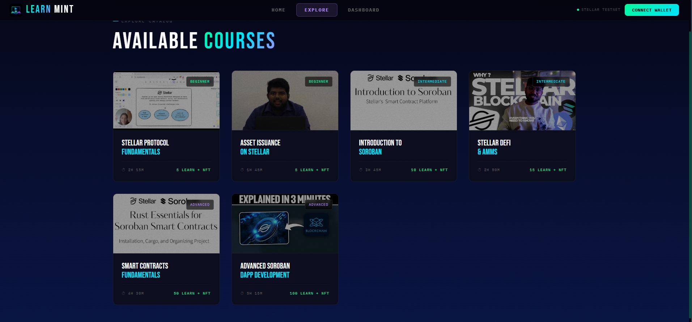
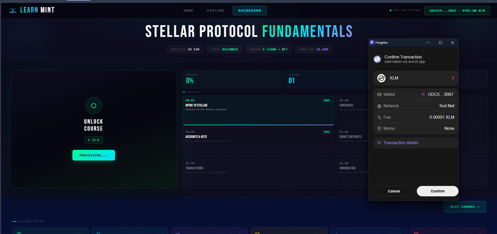
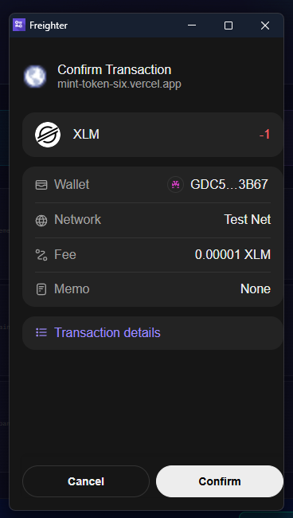
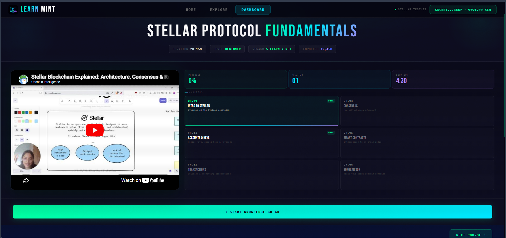
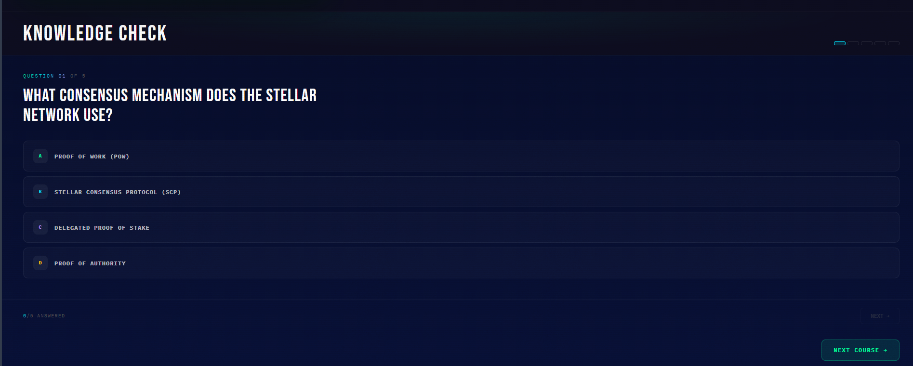
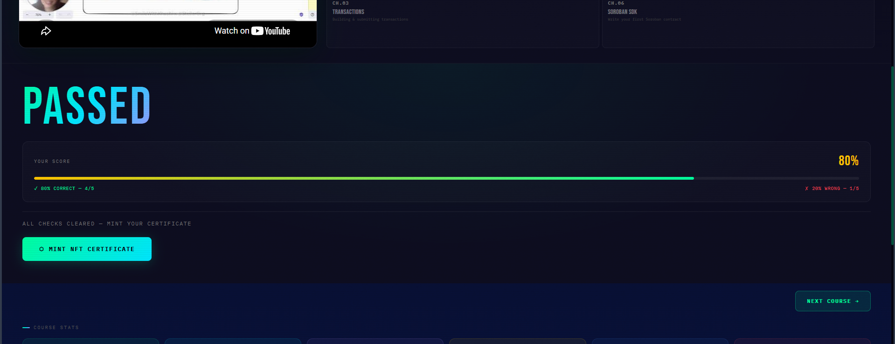
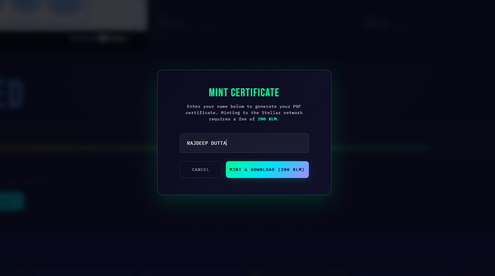
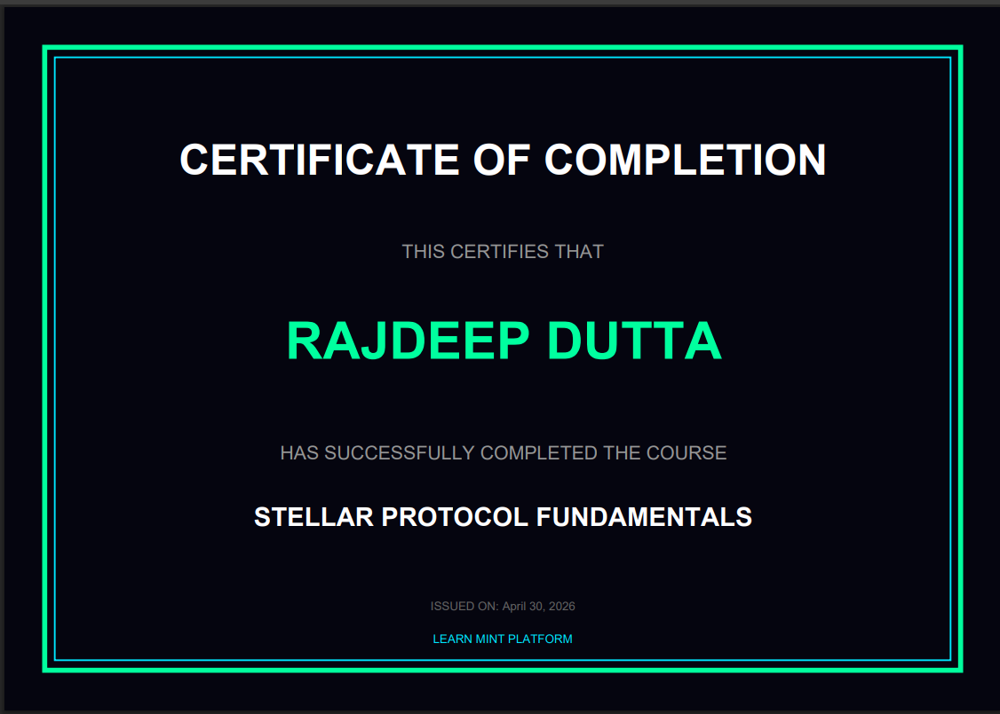
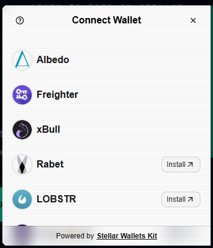

<p align="center">
  
</p>

<h1 align="center">🎓 Learn Mint</h1>

<p align="center">
  <b>Decentralized Learn-to-Earn Platform on Stellar Soroban</b> — Watch educational reels, pass on-chain quizzes, earn LEARN tokens & mint NFT certificates.
</p>

[](https://stellar.org)
[](https://soroban.stellar.org)
[](https://nextjs.org)
[](https://typescriptlang.org)
[](https://rust-lang.org)
[](LICENSE)
[](https://github.com/Rajdeep-droid/Mint-Token/actions/workflows/main.yml)

---

## 🎯 Problem

Web3 education today suffers from three critical issues:

1. **No Incentive** — Learners have no financial motivation to complete courses or retain knowledge
2. **No Verification** — Certificates are easily faked; there's no on-chain proof of competence
3. **Centralized Platforms** — Udemy/Coursera control content, pricing, and credential ownership

## 💡 Solution

**Learn Mint** solves this with a fully on-chain learn-to-earn protocol:

| Problem                | Learn Mint Solution                                                  |
| ---------------------- | -------------------------------------------------------------------- |
| No Incentive           | Earn **LEARN tokens** for every quiz passed — real on-chain rewards  |
| No Verification        | **NFT Certificates** minted to your wallet — immutable proof         |
| Centralized Platforms  | Soroban smart contracts handle all logic — no middlemen              |

---

## 🏗️ System Architecture

```
                         ┌──────────────────────────────────────┐
                         │           LEARN MINT PLATFORM        │
                         └──────────────────────────────────────┘
                                         │
                    ┌────────────────────┼────────────────────┐
                    ▼                    ▼                    ▼
            ┌──────────────┐   ┌─────────────────┐   ┌──────────────┐
            │   Next.js    │   │  Freighter       │   │  Stellar     │
            │   Frontend   │   │  Wallet          │   │  Horizon     │
            │   (React)    │   │  (Browser Ext)   │   │  API         │
            └──────┬───────┘   └────────┬────────┘   └──────┬───────┘
                   │                    │                    │
                   └────────────┬───────┘                    │
                                ▼                            │
                    ┌───────────────────────┐                │
                    │    Soroban RPC        │                │
                    │    (Testnet)          │                │
                    └───────────┬───────────┘                │
                                │                            │
                    ┌───────────┴───────────────────────────┐│
                    │         STELLAR TESTNET               ││
                    │                                       ││
                    │  ┌─────────────────┐                  ││
                    │  │  Course & Quiz  │──── mint() ──┐   ││
                    │  │  Contract       │              │   ││
                    │  └─────────────────┘              ▼   ││
                    │       ↑                  ┌────────────┐││
                    │       │ unlock (1 XLM)   │  Reward    │││
                    │       │ submit_quiz()     │  Token     │││
                    │       │                  │  (LEARN)   │││
                    │  [User Wallet] ◄─────────│  SEP-41    │││
                    │                          └────────────┘││
                    └───────────────────────────────────────┘│
                                                             │
                    ┌────────────────────────────────────────┘
                    ▼
            ┌──────────────────┐
            │  PDF Certificate │
            │  + 200 XLM Mint  │
            │  Transaction     │
            └──────────────────┘
```

---

## 🌐 Live Preview

### 1. Home Page — Landing


### 2. Explore — Course Catalog


### 3. Dashboard — Learning Hub


### 4. Wallet Connection


### 5. Video Lecture


### 6. Knowledge Quiz


### 7. Quiz Results


### 8. Mint Certificate


### 9. PDF Certificate


### 10. Multi-Wallet Selection


---

## ✨ Key Features

### 📺 Short-Form Video Learning
- YouTube-powered educational reels in a sleek vertical player
- Chapter navigation with real-time progress tracking
- Unlock courses with a **1 XLM** payment via Freighter wallet

### 📝 On-Chain Quiz Validation
- 5-question multiple-choice quizzes per course
- **60% pass rate** required (3 out of 5 correct)
- Score breakdown with visual progress bar (correct % vs wrong %)
- Retake available on failure — answers are never revealed

### 🏅 NFT Certificate Minting
- Pass the quiz → Click **"Mint NFT Certificate"**
- Enter your name in a premium glassmorphic modal
- Pay **200 XLM** mint fee via Freighter wallet popup
- PDF certificate auto-downloads with your name, course title, and issue date
- Dark-themed certificate with neon border matching platform aesthetics

### 🪙 LEARN Token Rewards
- **10 LEARN tokens** minted to your wallet per completed course
- Standard SEP-41 token on Stellar Testnet
- Cross-contract call from Course Quiz → Reward Token

### 📊 Dashboard Analytics
- Real-time course stats (duration, level, enrollment, rewards)
- Recent graduates feed with live blockchain event polling
- Certificate panel with completion status

---

## 🔄 Complete Learning Flow

```
User                     Frontend                    Stellar Blockchain
 │                          │                              │
 │── Connect Freighter ────►│                              │
 │                          │◄──── Account balance ────────│
 │                          │                              │
 │── Click "UNLOCK" ───────►│                              │
 │                          │── Build 1 XLM Payment Tx ──►│
 │◄── Freighter popup ──────│                              │
 │── Approve ──────────────►│── Submit Signed Tx ─────────►│
 │                          │◄──── Tx confirmed ───────────│
 │◄── Video unlocked ───────│                              │
 │                          │                              │
 │── Watch video ──────────►│                              │
 │── Start quiz ───────────►│                              │
 │── Answer 5 questions ───►│                              │
 │                          │── Validate answers ──────────│
 │                          │   (≥60% = PASS)              │
 │◄── Score: 80% PASSED ────│                              │
 │                          │                              │
 │── "Mint Certificate" ───►│                              │
 │── Enter name ───────────►│                              │
 │                          │── Build 200 XLM Tx ─────────►│
 │◄── Freighter popup ──────│                              │
 │── Approve ──────────────►│── Submit Signed Tx ─────────►│
 │                          │◄──── Tx confirmed ───────────│
 │◄── PDF downloaded ───────│                              │
 │◄── Balance refreshed ────│◄──── New balance ────────────│
```

---

## 📜 Contract Addresses (Stellar Testnet)

| Contract | Address | Explorer |
|----------|---------|----------|
| `reward-token` (LEARN) | `CA2T3MHAHMEDQOS2USPCKD323VQKGS6KU22HGDOKECCWWBRTDGIIDANB` | [View on Stellar Expert ↗](https://stellar.expert/explorer/testnet/contract/CA2T3MHAHMEDQOS2USPCKD323VQKGS6KU22HGDOKECCWWBRTDGIIDANB) |
| `course-quiz` | `CCQ4HASUBNKJMK2U47SWQXIBATOCCRA42VBQT5FYHGRJBSD5XZ2SUJKJ` | [View on Stellar Expert ↗](https://stellar.expert/explorer/testnet/contract/CCQ4HASUBNKJMK2U47SWQXIBATOCCRA42VBQT5FYHGRJBSD5XZ2SUJKJ) |

> **Network:** Stellar Testnet | **RPC:** `https://soroban-testnet.stellar.org`

### 🪙 Custom Token — LEARN

|                |                                                                 |
| -------------- | --------------------------------------------------------------- |
| **Token Name** | LEARN                                                           |
| **Standard**   | SEP-41 (Soroban Token Interface)                                |
| **Contract**   | `CA2T3MHAHMEDQOS2USPCKD323VQKGS6KU22HGDOKECCWWBRTDGIIDANB`     |
| **Decimals**   | 7                                                               |
| **Purpose**    | Reward token — earned by completing courses and passing quizzes  |
| **Minting**    | Only the Course Quiz contract has admin authority to mint        |

**Inter-contract calls verified:** `CourseQuiz` → `RewardToken.mint(user, amount)` on successful quiz submission.

---

## 🧪 Tech Stack

| Layer               | Technology                                          |
| ------------------- | --------------------------------------------------- |
| **Frontend**        | Next.js 16, React 19, TypeScript                    |
| **Styling**         | TailwindCSS + Custom CSS Design System              |
| **Smart Contracts** | Rust, Soroban SDK v25.1.0                           |
| **Blockchain**      | Stellar Testnet (Soroban RPC + Horizon)             |
| **Wallet**          | Freighter Browser Extension (`@stellar/freighter-api`) |
| **PDF Generation**  | jsPDF                                               |
| **Video Player**    | react-player (YouTube integration)                  |
| **SDK**             | `@stellar/stellar-sdk` v15                          |

---

## ⚙️ CI/CD Pipeline

GitHub Actions runs on every push/PR to `main`:

- **Lint** → ESLint type-check
- **Test** → Jest test suite with coverage
- **Build** → Next.js production build verification
- **Deploy** → Automatic deployment to Vercel (on push to main)

[](https://github.com/Rajdeep-droid/Mint-Token/actions/workflows/main.yml)

---

## 📂 Project Structure

```
Learn-Mint/
├── .github/
│   └── workflows/
│       └── main.yml              # CI/CD: lint → test → build → deploy
│
├── contracts/                     # Soroban smart contracts (Rust)
│   ├── reward-token/             # SEP-41 LEARN token
│   │   └── src/
│   │       ├── lib.rs            # Module root
│   │       ├── contract.rs       # Constructor, mint, TokenInterface
│   │       ├── admin.rs          # Admin address read/write
│   │       ├── balance.rs        # User balance management
│   │       ├── allowance.rs      # ERC-20 style approve/transferFrom
│   │       ├── metadata.rs       # Token name, symbol, decimals
│   │       ├── storage_types.rs  # Data keys & TTL constants
│   │       └── test.rs           # Unit tests
│   │
│   └── course-quiz/              # Course unlock + quiz validation
│       └── src/
│           ├── lib.rs            # Module root
│           ├── contract.rs       # create_course, unlock, submit_quiz
│           ├── storage_types.rs  # Storage keys
│           └── test.rs           # Unit tests
│
├── frontend/                      # Next.js frontend
│   ├── src/
│   │   ├── app/
│   │   │   ├── page.tsx          # Landing page (Hero + Stats + Features)
│   │   │   ├── layout.tsx        # Root layout (NavBar, Wallet, Toast)
│   │   │   ├── globals.css       # Design system + responsive utilities
│   │   │   ├── dashboard/
│   │   │   │   └── page.tsx      # Main learning dashboard
│   │   │   └── explore/
│   │   │       └── page.tsx      # Course catalog grid
│   │   │
│   │   ├── components/
│   │   │   ├── NavBar.tsx        # Navigation bar (responsive)
│   │   │   ├── CourseView.tsx    # Course header + video + quiz + mint modal
│   │   │   ├── QuizModule.tsx    # Quiz UI with score breakdown
│   │   │   ├── VideoPlayer.tsx   # YouTube player + chapter grid
│   │   │   ├── CourseInfoPanel.tsx # 6-stat course analytics strip
│   │   │   ├── CertificatePanel.tsx # Certificate display panel
│   │   │   ├── RecentGraduates.tsx  # Live graduate activity feed
│   │   │   ├── AnimatedStat.tsx  # Animated counter component
│   │   │   ├── HeroIcons.tsx     # Floating 3D icon animations
│   │   │   ├── BottomTicker.tsx  # Scrolling ticker bar
│   │   │   ├── FilmGrain.tsx     # Aesthetic film grain overlay
│   │   │   └── Toast.tsx         # Notification toast system
│   │   │
│   │   ├── context/
│   │   │   └── WalletProvider.tsx # Freighter wallet state + tx signing
│   │   │
│   │   ├── hooks/
│   │   │   ├── useQuizState.ts   # Quiz answer tracking (localStorage)
│   │   │   ├── useVideoProgress.ts # Video playback progress
│   │   │   └── useLocalStorage.ts  # Generic localStorage hook
│   │   │
│   │   ├── lib/
│   │   │   ├── stellar.ts       # Soroban RPC helpers + contract IDs
│   │   │   ├── eventListener.ts  # Blockchain event stream polling
│   │   │   └── pdfGenerator.ts   # Certificate PDF generation (jsPDF)
│   │   │
│   │   └── data/
│   │       └── courses.ts        # Course catalog + quiz questions
│   │
│   ├── public/
│   │   └── logo.jpg              # Platform logo
│   └── package.json
│
└── README.md
```

---

## 🚀 Getting Started

### Prerequisites

- **Node.js 20+**
- **Rust & Cargo** (for smart contract compilation)
- **Stellar CLI** (`stellar`) — [Install](https://developers.stellar.org/docs/tools/developer-tools/cli/install-cli)
- **Freighter Wallet** (browser extension) — [Install](https://freighter.app)

### Install & Run

```bash
# Clone the repository
git clone https://github.com/Rajdeep-droid/Mint-Token.git
cd Mint-Token

# Install frontend dependencies
cd frontend
npm install

# Create environment file
cp .env.local.example .env.local
# Or manually create .env.local with:
#   NEXT_PUBLIC_STELLAR_NETWORK=testnet
#   NEXT_PUBLIC_REWARD_TOKEN_ID=CA2T3MHAHMEDQOS2USPCKD323VQKGS6KU22HGDOKECCWWBRTDGIIDANB
#   NEXT_PUBLIC_COURSE_QUIZ_ID=CCQ4HASUBNKJMK2U47SWQXIBATOCCRA42VBQT5FYHGRJBSD5XZ2SUJKJ

# Run development server
npm run dev
# → http://localhost:3000
```

### Build Smart Contracts

```bash
cd contracts/reward-token
cargo build --target wasm32-unknown-unknown --release

cd ../course-quiz
cargo build --target wasm32-unknown-unknown --release

# Output: contracts/target/wasm32-unknown-unknown/release/*.wasm
```

### Environment Variables

| Variable | Description | Required |
|----------|-------------|----------|
| `NEXT_PUBLIC_STELLAR_NETWORK` | Network (`testnet` or `mainnet`) | ✅ |
| `NEXT_PUBLIC_REWARD_TOKEN_ID` | LEARN token contract address | ✅ |
| `NEXT_PUBLIC_COURSE_QUIZ_ID` | Course Quiz contract address | ✅ |

---

## 🔐 Key Implementation Details

### Cross-Contract Calls

The Course Quiz contract has admin authority over the Reward Token. When a user passes a quiz, the contract executes:

```rust
// Inside course-quiz contract
fn submit_quiz(env, user, course_id, answers) {
    // 1. Validate answers against stored answer key
    // 2. If correct → cross-contract call:
    reward_token_client.mint(&user, &reward_amount);
    // 3. Emit QuizPassed event
}
```

### Payment Transactions

All XLM payments (course unlock: 1 XLM, certificate mint: 200 XLM) are built client-side using `@stellar/stellar-sdk` and signed via Freighter:

```typescript
const tx = new TransactionBuilder(account, { fee: "100", networkPassphrase: Networks.TESTNET })
  .addOperation(Operation.payment({
    destination: PLATFORM_ADDRESS,
    asset: Asset.native(),
    amount: "200", // or "1" for course unlock
  }))
  .setTimeout(60)
  .build();

const signedXdr = await signTransaction(tx.toXDR()); // Freighter popup
```

### PDF Certificate Generation

Certificates are generated entirely client-side using `jsPDF`:
- Dark background (`#050510`) with neon green border (`#00FF9F`)
- User's name, course title, and issue date
- Automatic download after successful 200 XLM transaction

### Mobile Responsiveness

The platform is fully responsive using CSS media queries:
- **≤ 1024px** — Tablet layout (2-column grids, stacked video)
- **≤ 768px** — Mobile layout (single column, reduced padding, wrapped navigation)

---

## 🤝 Why Stellar?

- **< 5 second** finality — instant course unlock & token rewards
- **< $0.01** transaction fees — accessible to learners worldwide
- **Soroban** — production-ready smart contract platform for quiz validation
- **SEP-41** — Standard token interface for LEARN rewards
- **Freighter** — Seamless browser wallet integration

---

## 📄 License

MIT License — free to use, modify, and distribute.

---

<p align="center">
  Built with ❤️ on <b>Stellar</b> for the future of decentralized education
</p>
